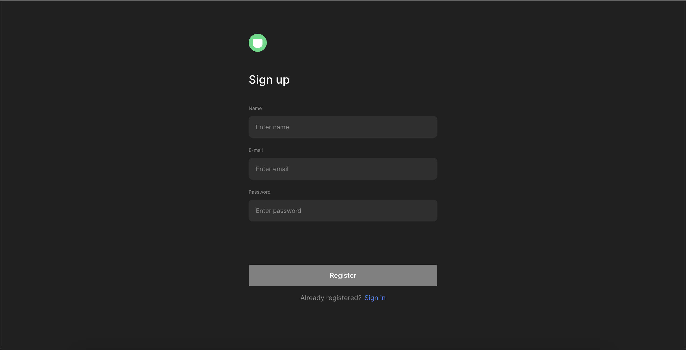

# Movies Explorer (Frontend)
This is the frontend part of the final project of the web development course.  
The backend part (API) can be found <a href="https://github.com/vlad-lis/movies-explorer-api" target="_blank">here</a>.

* Public address: <a href="https://movie-explorer.nomoredomains.monster/" target="_blank">https://movie-explorer.nomoredomains.monster/</a>  
* Public IP: 158.160.39.63

To run locally see [instructions](#run-locally) below.

## Description
The main purpose of the project is to search for movies by name using a third-party API and then save them to favorites via the [developed API](https://github.com/vlad-lis/movies-explorer-api).  

* The main page contains general information about the project:  


* To use the movie search feature, users need to sign up or sign in first:   
  


* After successfully signing in, users are redirected to the /movies route, where they can search for movies by name and save or delete movies from their favorites:


* In the account window, users are able to edit their profile information or log out:


## Run locally
1. Clone repository.  

2. Install dependencies (```$npm i```).  

3. While in the local repository run ```$npm run start```.  

4. Open [http://localhost:3000](http://localhost:3000) to view it in your browser.
